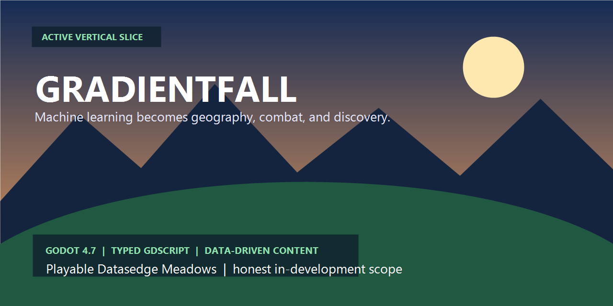
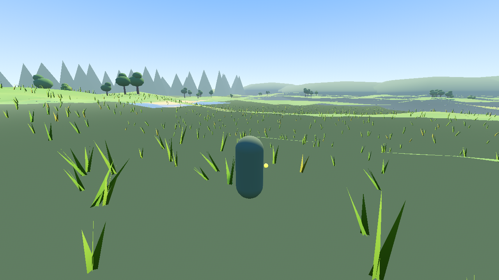
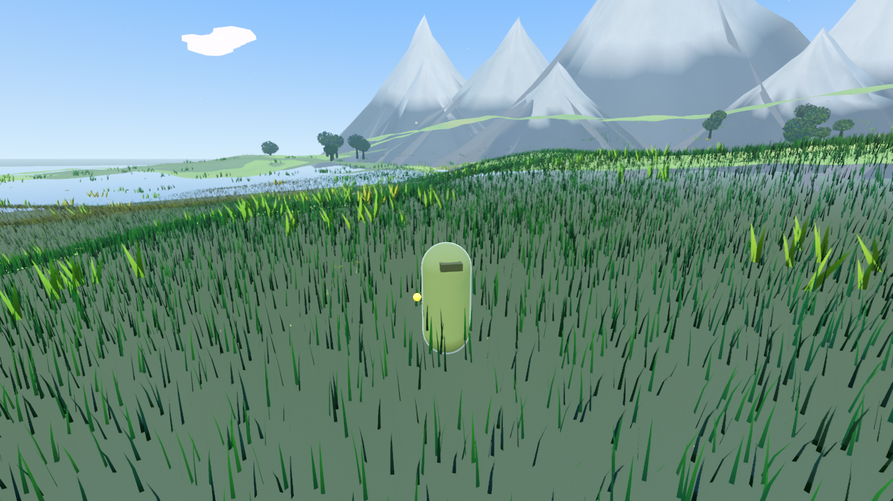
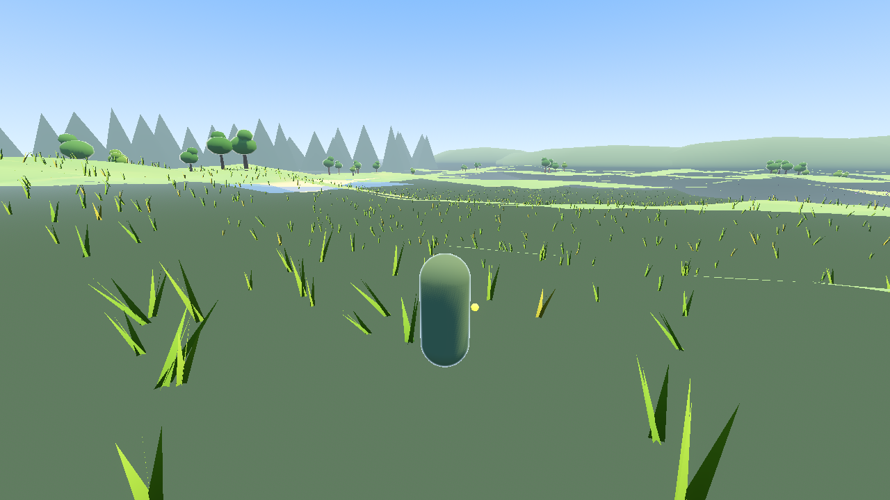
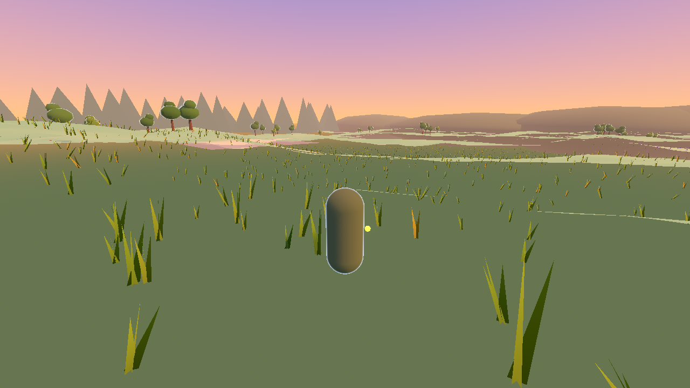
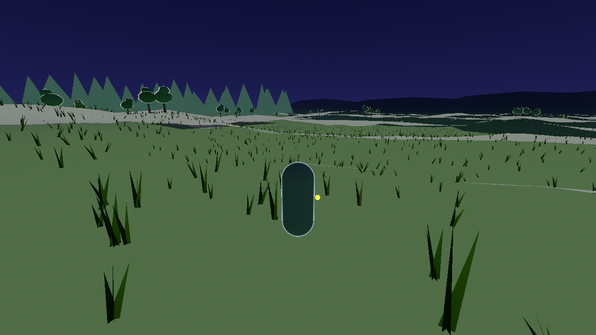
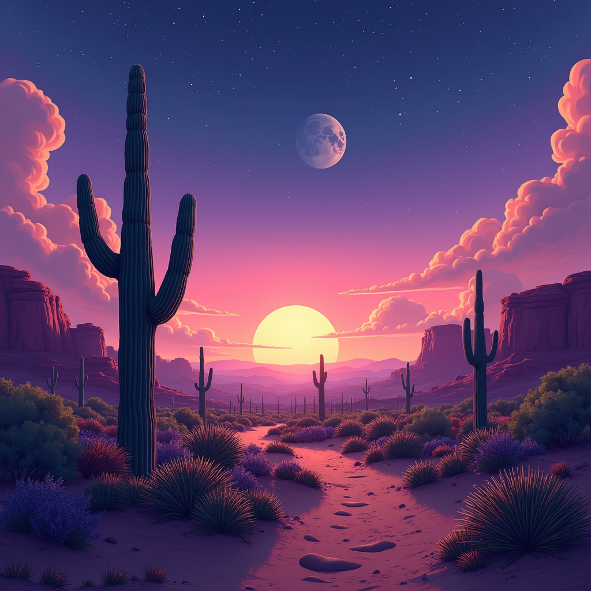

# Gradientfall

[](https://github.com/danieltalbert/gradientfall/actions/workflows/verify.yml)
[](https://godotengine.org/)
[](docs/ROADMAP.md)
[](LICENSE)

Gradientfall is an in-development 3D action-adventure that turns machine-learning concepts into geography, combat, quests, and exploration. The current build is an honest **vertical slice**: a playable Datasedge Meadows environment with a third-person controller, data-driven content, real-time combat foundations, the Bit companion, and a deliberately ambitious code-authored visual stack.



**Explore:** [documentation map](docs/README.md) · [current roadmap](docs/ROADMAP.md) · [worldbook](docs/WORLDBOOK.md) · [runtime architecture](docs/ARCHITECTURE.md) · [run locally](#run-locally)

## Visual proof from the current slice

| Datasedge Meadows | Gradient Peaks |
| --- | --- |
|  |  |
| **One generated world, multiple systems.** Terrain, grass, paths, vegetation, landmarks, and atmosphere are authored in code. | **Readable depth without downloaded scenery.** Layering, color, and scale establish a destination beyond the playable meadow. |

| Day | Dusk | Night |
| --- | --- | --- |
|  |  |  |

These are in-engine progress captures, not target renders. They document the current visual stack and make later regressions easier to recognize.

## What is working today

- Godot 4.7 project with a typed GDScript architecture and autoload-based state/event boundaries.
- Third-person movement and camera controls in a generated 3D landscape.
- Melee/ranged combat foundations, enemy spawning, health, damage shards, and combat HUD.
- Bit companion behavior and landmark reactions.
- Bootstrap town with 13 approved villagers, lit buildings, and proximity dialogue.
- The Perceptron Vault's playable 2-3-1 neural-network dungeon and Gatekeeper encounter.
- A 700-bloom Iris field whose specimen measurements feed an in-game classifier compendium.
- Dynamic sky, celestial layers, clouds, water, terrain, grass, vegetation, particles, and painterly shaders.
- Schema-validated JSON pipeline for quests, NPCs, items, monsters, quizzes, lore, and points of interest.
- 111 approved content entries across all seven content types; the staging inbox currently validates empty.

This repository does **not** claim that the ten-region, 40–80 hour design is complete. The vision is documented in [the GDD](docs/GDD.md); the shipped scope and next gates live in [the roadmap](docs/ROADMAP.md) and [devlog](docs/DEVLOG.md).

## Project principles

- **Quality over speed.** The single most important factor of this entire project. Milestones ship when they are verified, documented, and understandable by a stranger — never to keep pace. The full contract lives in [CLAUDE.md](CLAUDE.md).
- **Documentation is a first-class deliverable.** Every script carries a doc header and member docs to the standard in [docs/ARCHITECTURE.md](docs/ARCHITECTURE.md); every session appends a dated entry to [the devlog](docs/DEVLOG.md); roadmap checkboxes and content-budget ticks are updated in the same commit as the work.

## Worldbuilding mood study



This locally generated image is an **art-direction mood study, not gameplay and not locked canon**. It explores the patient scale, warm twilight, and open traversal language of the future Tensor Desert; the [Worldbook](docs/WORLDBOOK.md) remains the authority for the region's golden dunes, buried matrix ruins, grid-patterned sands, and MNIST rune architecture.

## Architecture

```text
content/       JSON schemas, inbox batches, and approved game content
docs/          GDD, worldbook, roadmap, devlog, and content workflow
game/          Godot project, scenes, typed scripts, and code-authored assets
tools/         content validation and authoring utilities
```

The runtime never hardcodes authored content. `ContentDB` loads validated entries from `content/approved`, while `GameState` owns durable state and `EventBus` handles cross-system signals. See [docs/ARCHITECTURE.md](docs/ARCHITECTURE.md) and [docs/CONTENT_PIPELINE.md](docs/CONTENT_PIPELINE.md).

## Run locally

Requirements: Godot 4.7.1 and Python 3.11+.

```powershell
python tools/validate_content.py --inbox
python tools/validate_content.py --all
godot --editor --path game
```

The local verification gate is:

```powershell
godot --headless --editor --path game --quit
```

Godot can return zero even when its output contains a script parse error, so CI also rejects `SCRIPT ERROR`, `Parse Error`, and failed-script-load messages.

## Provenance

Gradientfall was extracted from the `danieltalbert` profile repository with its path history intact, then updated from a verified source-only snapshot of active local work. Generated engine caches and agent-only metadata were deliberately excluded.

## License

Original code, documentation, and code-authored assets are available under the [MIT License](LICENSE). Dataset extracts will be added only with explicit source and license records before release.
