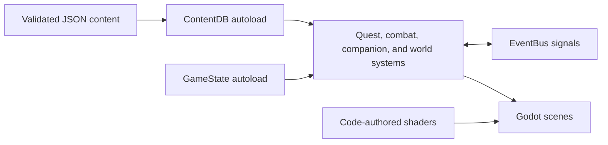

# Runtime architecture

Gradientfall separates authored content from engine behavior so the planned world can grow without turning individual scenes into data stores.

## Boundaries

- `ContentDB` reads only schema-approved records from `content/approved`.
- `GameState` is the owner of durable player/world state.
- `EventBus` carries cross-system notifications without hard scene dependencies.
- `game/src` mirrors `game/scenes`; scripts remain typed and narrowly scoped.
- World geometry, visual assets, and shaders are authored in code. Godot import caches are generated locally and ignored.

The current slice is deliberately single-region. New regions should reuse these boundaries, add content through the same validator, and remain independently bootable before expansion continues.

## Code documentation standard

Documentation is a first-class deliverable of this project, and quality over
speed is its prime directive (see `CLAUDE.md`). Every code file must be
understandable by a developer who has never seen it before, from its comments
alone:

- **Script headers.** Every `.gd` file opens with a GDScript doc comment
  (`##`) block above `class_name`/`extends`: one summary line, then what the
  script does, where it sits in this architecture (autoload? attached to which
  scene/node? instanced by whom?), the signals it emits/consumes, and its
  conventions (units, coordinate frames, value ranges).
- **Member docs.** Signals, exported variables, non-obvious constants, and
  every non-trivial function carry a `##` doc comment: purpose, non-obvious
  parameters/returns, side effects, and signals emitted. Godot surfaces these
  in the editor help.
- **Why-comments.** Inline `#` comments explain the *why* of non-obvious
  logic — the math (noise, easing, lighting), what magic numbers mean (with
  units: meters, seconds, radians), and gameplay intent (i-frames, combo
  buffers, aggro ranges). Comments that restate the code are noise and are
  not welcome.
- **Shaders and tools.** `.gdshader` files open with a `//` header block
  (what the shader renders, its technique, key uniforms); Python tools carry
  module and function docstrings.
- **Accuracy is sacred.** A wrong or stale comment is a bug — worse than no
  comment. Comments are updated in the same change as the code they describe.

Code that does not meet this standard does not land. Reviewers (human or
agent) should reject changes whose documentation lags the code.
