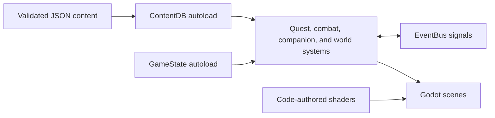
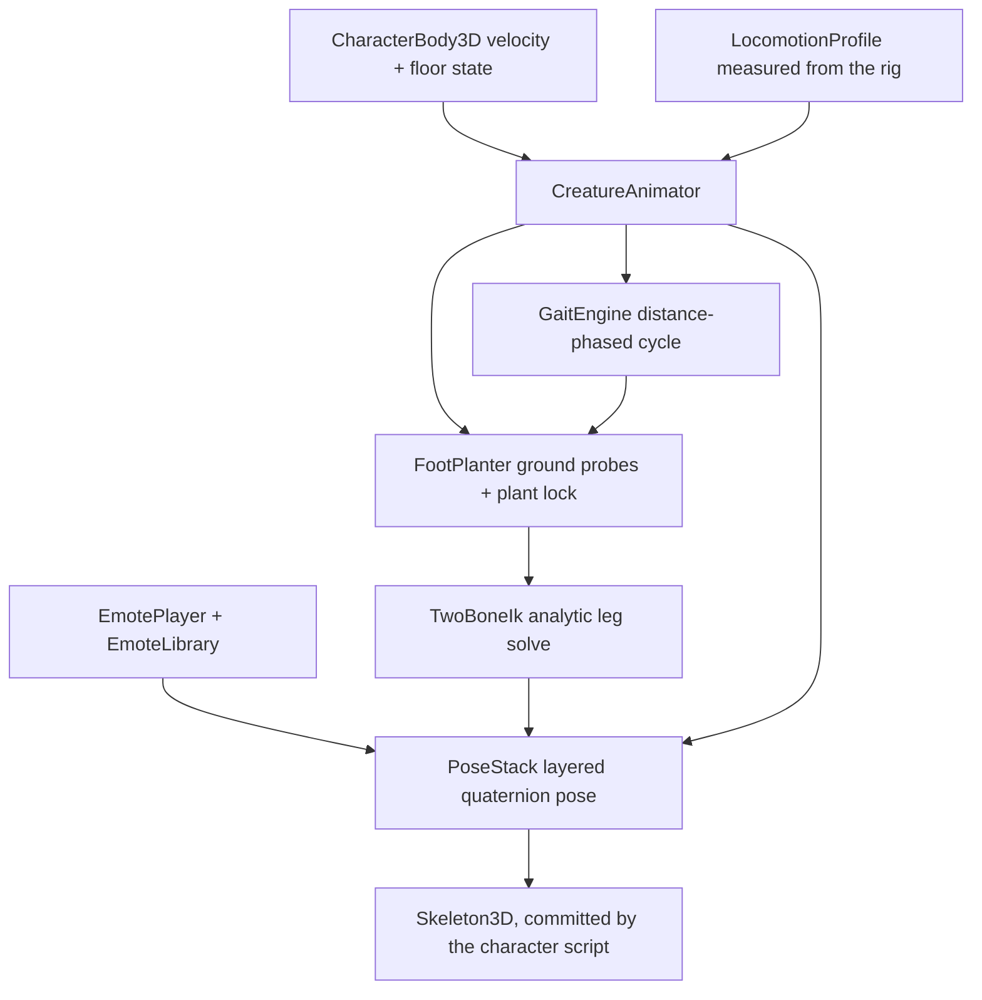

# Runtime architecture

Gradientfall separates authored content from engine behavior so the planned world can grow without turning individual scenes into data stores.

## Boundaries

- `ContentDB` reads only schema-approved records from `content/approved`.
- `GameState` is the owner of durable player/world state.
- `EventBus` carries cross-system notifications without hard scene dependencies.
- `game/src` mirrors `game/scenes`; scripts remain typed and narrowly scoped.
- World geometry, visual assets, and shaders are authored in code. Godot import caches are generated locally and ignored.

The current slice is deliberately single-region. New regions should reuse these boundaries, add content through the same validator, and remain independently bootable before expansion continues.

## Wiring new systems into `main.gd`

`Main._ready()` is the one place every gameplay system gets instanced, which
makes it the file parallel sessions collide in most often. The convention:

- Give each system its own `_setup_<system>()` function and call it from
  `_ready()` with **exactly one line**. Do not add instancing code inline —
  two sessions editing the same block conflict; two sessions each adding one
  call line resolve trivially.
- Keep screenshot mode clean. `_ready()` branches: with `--screenshot=<dir>`
  it captures and quits, taking no HUD and no roaming enemies. Systems that
  add UI or spawn actors belong on the normal-play branch only, so visual
  verification shots stay uncluttered.
- Prefer `EventBus` signals over direct references between systems. A system
  that only listens needs no wiring in `main.gd` at all.

## Procedural animation (`game/src/anim/`)

Gradientfall generates every asset in code, so there are no motion-capture
clips to blend. Movement is instead a small stack of creature-agnostic modules
that turn physics state into a pose. Kern is the first consumer; every future
villager, monster and boss is meant to be the next.

**The load-bearing idea: the gait is phased by DISTANCE, not time.**
`GaitEngine.advance()` integrates `distance_travelled / stride_length`. Because
a planted foot's body-relative position then retreats at exactly the speed the
body advances, the foot holds still in world space for the whole stance. Foot
slip goes to zero as an algebraic identity rather than as a tuned
approximation — at any speed, mid-acceleration, and across gait changes. The
placeholder version advanced its cycle on a timer while the body moved at
whatever speed it liked, which is why its feet skated.

Module responsibilities, all leaf-first so each is testable alone:

- `anim_math.gd` — frame-rate-independent damping (half-life based) and exact
  critically-damped springs. Nothing here uses `lerp(a, b, k * delta)`, which
  converges at different real-world speeds on different hardware.
- `gait_profile.gd` — one gait as biomechanics (stride, duty factor, pelvic
  oscillation, foot levers), plus human presets. Gaits blend *continuously* by
  speed, so there is no walk/run threshold to pop at.
- `gait_engine.gd` — the distance-phased cycle; per-foot stance/swing state and
  whole-body oscillation. The foot is treated as a rigid lever rocking over
  heel and toe, so the contact patch stays exactly still through the roll.
- `foot_planter.gd` — raycasts the real collision world under each foot, locks
  the plant in world space (with a leash so pivoting scuffs rather than
  sticking), aligns ankles to the surface, and drops the pelvis to keep a
  downhill foot reachable.
- `two_bone_ik.gd` — closed-form law-of-cosines leg/arm solve. Analytic rather
  than `SkeletonIK3D` because it is exact, allocation-free, and — critically —
  blendable against the procedural pose like any other layer.
- `locomotion_profile.gd` — measures the creature's limb lengths and joint rest
  positions off its own `Skeleton3D` and rescales the gait presets by leg
  length (dynamic similarity). Nothing is hard-coded per creature.
- `pose_stack.gd` — the frame's pose as layered quaternions plus a root offset.
  Quaternions because layers must *compose*; adding euler triples is not
  composing rotations, and it gimbals as soon as an emote overlays a gait.
- `emote_library.gd` / `emote_player.gd` — emotes and dances as functions of
  time, with blend-in/out and partial-body support so a wave can play over a
  walk while a dance takes the whole body.
- `creature_animator.gd` — the coordinator that runs the above in order and
  layers idle life, momentum lean, airborne and landing behaviour on top.

### Adopting it for a new creature

1. Build the creature a `Skeleton3D` whose bones carry the names in
   `kern_bone_map.gd` (`Hips`, `Spine`, `Chest`, `ThighL`, `ShinL`, `FootL`, …).
   Missing bones are simply not driven, so a partial rig degrades rather than
   erroring.
2. Construct a `CreatureAnimator` and `bind()` it to the visual node, the
   physics body, the skeleton and its bone map.
3. Call `tick(delta, velocity, on_floor, crouch)` from `_physics_process` and
   commit the returned `PoseStack` to the skeleton.
4. Tune by editing that creature's `GaitProfile` numbers — stride, duty factor,
   foot levers — not by writing new animation code.

A quadruped is the same machinery with four `FootPlanter`s and two
`GaitEngine`s phase-offset against each other; nothing in the modules assumes
two legs except the presets.

### Verifying movement work

`game/src/dev/locomotion_lab.gd` (scene: `scenes/dev/locomotion_lab.tscn`) is
the instrumented bench. It builds a four-zone obstacle course, drives the real
controller through a scripted program via the `Input` singleton, and reports
foot slip, ground error, IK reach shortfall, pose jerk and knee direction per
segment as a table plus JSON. Movement changes are expected to quote its
numbers. Two hard-won cautions, both of which produced badly misleading
figures before they were fixed:

- Measure slip on the **instantaneous contact point** (heel while the toes are
  up, toe once the heel has lifted, ankle while flat), not on a fixed point of
  the foot — otherwise honest heel-and-toe rocker reads as sliding.
- Gate it on **stance**, not on the IK's `contact` weight. Contact deliberately
  ramps up before touchdown so the IK eases in, so it is true while the foot is
  still travelling at full speed.

## Code documentation standard

Documentation is a first-class deliverable of this project, and quality over
speed is its prime directive (see `CLAUDE.md`). Every code file must be
understandable by a developer who has never seen it before, from its comments
alone:

- **Script headers.** Every `.gd` file opens with a GDScript doc comment
  (`##`) block above `class_name`/`extends`: one summary line, then what the
  script does, where it sits in this architecture (autoload? attached to which
  scene/node? instanced by whom?), the signals it emits/consumes, and its
  conventions (units, coordinate frames, value ranges).
- **Member docs.** Signals, exported variables, non-obvious constants, and
  every non-trivial function carry a `##` doc comment: purpose, non-obvious
  parameters/returns, side effects, and signals emitted. Godot surfaces these
  in the editor help.
- **Why-comments.** Inline `#` comments explain the *why* of non-obvious
  logic — the math (noise, easing, lighting), what magic numbers mean (with
  units: meters, seconds, radians), and gameplay intent (i-frames, combo
  buffers, aggro ranges). Comments that restate the code are noise and are
  not welcome.
- **Shaders and tools.** `.gdshader` files open with a `//` header block
  (what the shader renders, its technique, key uniforms); Python tools carry
  module and function docstrings.
- **Accuracy is sacred.** A wrong or stale comment is a bug — worse than no
  comment. Comments are updated in the same change as the code they describe.

Code that does not meet this standard does not land. Reviewers (human or
agent) should reject changes whose documentation lags the code.
