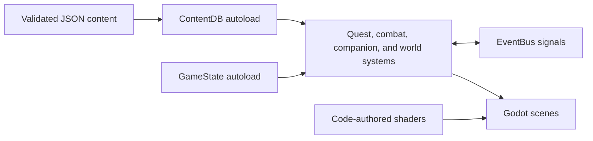

# Runtime architecture

Gradientfall separates authored content from engine behavior so the planned world can grow without turning individual scenes into data stores.

## Boundaries

- `ContentDB` reads only schema-approved records from `content/approved`.
- `GameState` is the owner of durable player/world state.
- `EventBus` carries cross-system notifications without hard scene dependencies.
- `game/src` mirrors `game/scenes`; scripts remain typed and narrowly scoped.
- World geometry, visual assets, and shaders are authored in code. Godot import caches are generated locally and ignored.

The current slice is deliberately single-region. New regions should reuse these boundaries, add content through the same validator, and remain independently bootable before expansion continues.
