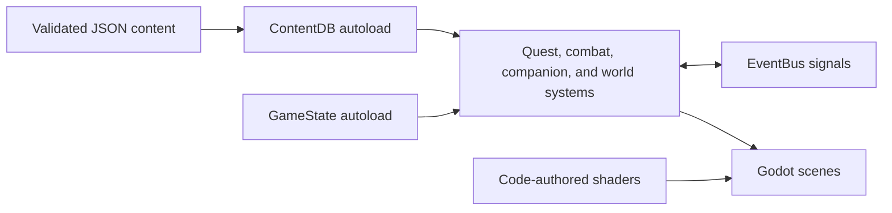

# Runtime architecture

Gradientfall separates authored content from engine behavior so the planned world can grow without turning individual scenes into data stores.

## Boundaries

- `ContentDB` reads only schema-approved records from `content/approved`.
- `GameState` is the owner of durable player/world state.
- `EventBus` carries cross-system notifications without hard scene dependencies.
- `game/src` mirrors `game/scenes`; scripts remain typed and narrowly scoped.
- World geometry, visual assets, and shaders are authored in code. Godot import caches are generated locally and ignored.
- Region builders own placement, never content: the town script knows where a villager stands, while every word they say comes from `ContentDB`. Content approved later appears without a code change.
- UI reads `EventBus` and nothing else. The dialogue box holds no reference to a villager, so it serves every region unchanged.
- `src/main/main.gd` is the wiring point: scene-authored systems are typed `@onready` references it hands their dependencies in `_ready`, and runtime-only systems (HUD, spawner, dialogue) are constructed there in small `_setup_*` functions so play mode and screenshot mode can differ.

The current slice is deliberately single-region. New regions should reuse these boundaries, add content through the same validator, and remain independently bootable before expansion continues.
